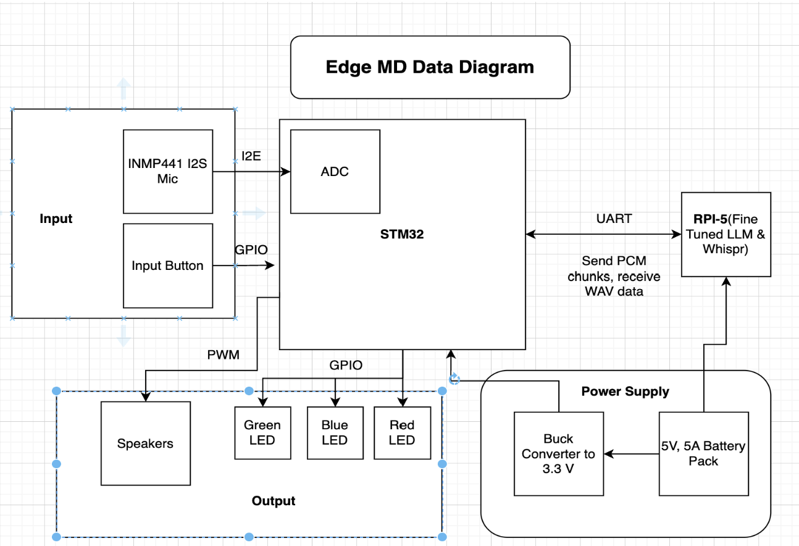
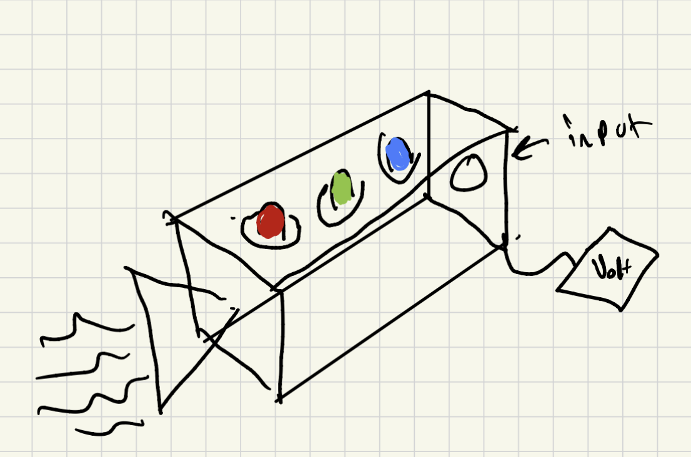
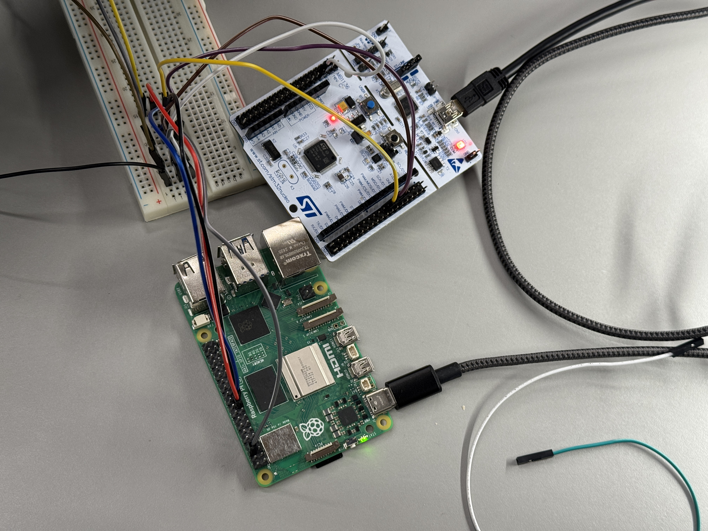
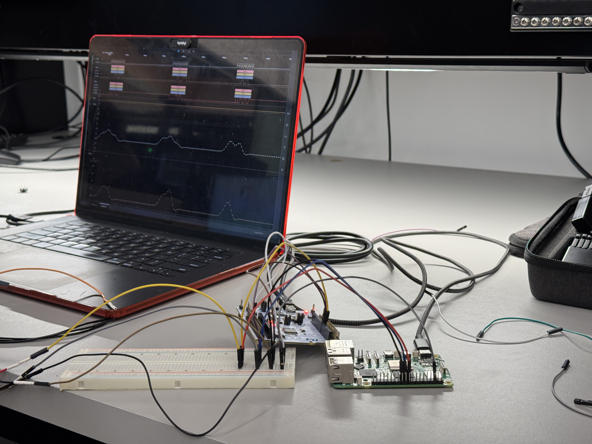
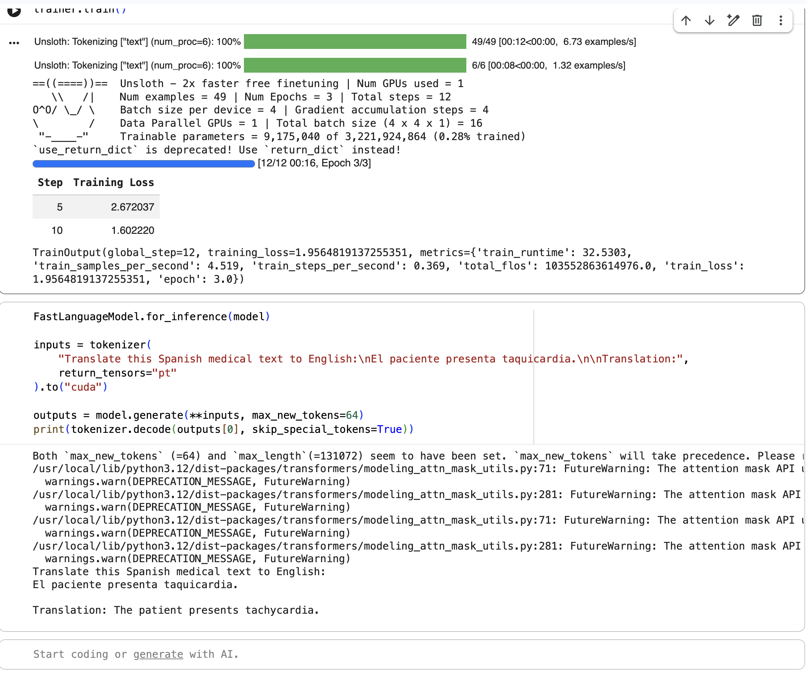
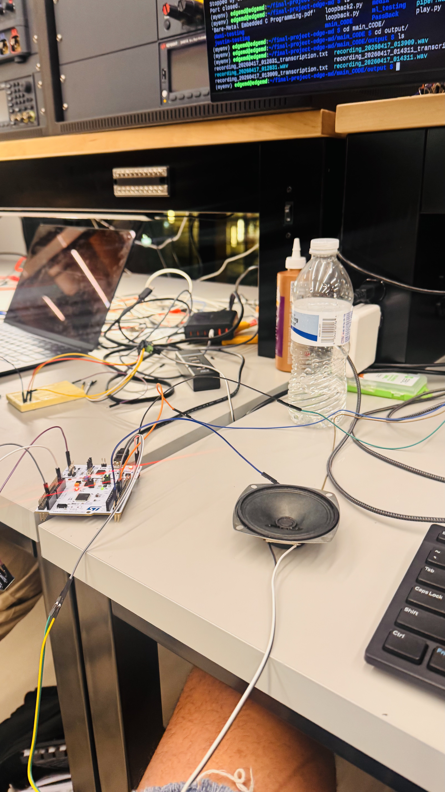
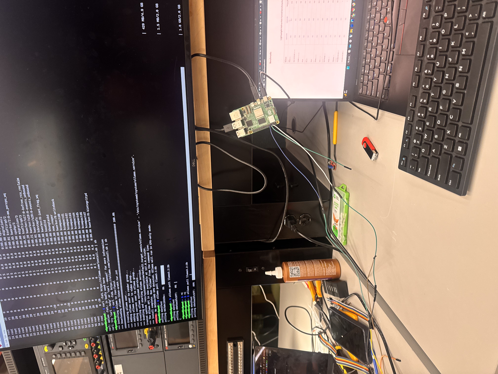
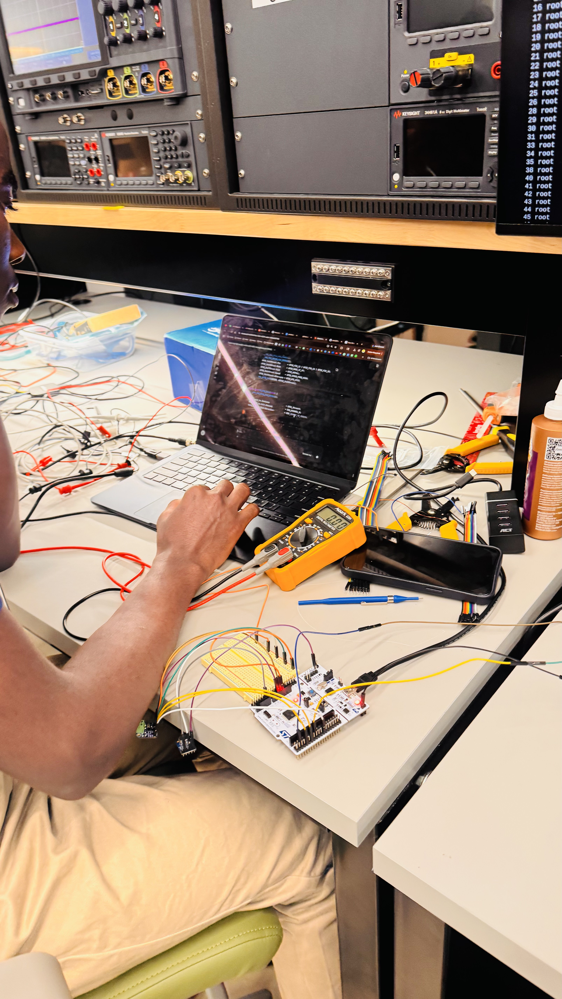
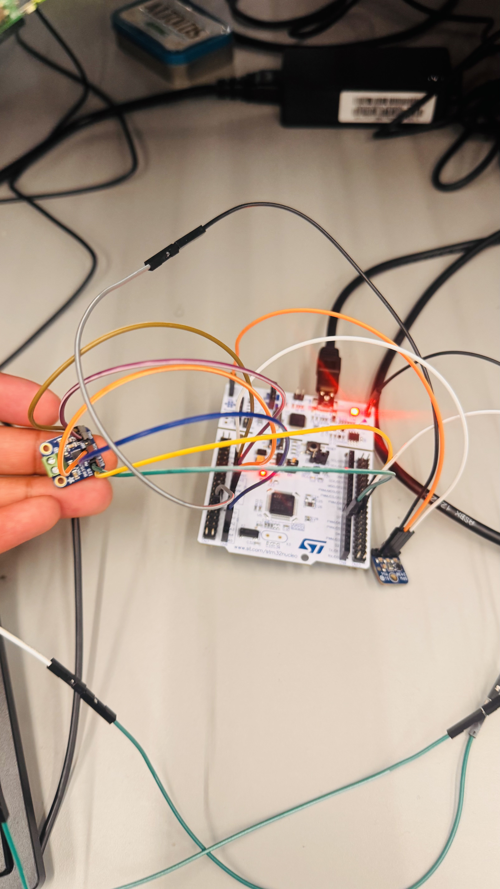

[](https://classroom.github.com/a/-Acvnhrq)

# Final Project

**Team Number:**

**6**

**Team Name:**

**EDGE MD**

| Team Member Name | Email Address                                                |
| ---------------- | ------------------------------------------------------------ |
| Justin Monchais  | [monchais@seas.upenn.edu](mailto:monchais@seas.upenn.edu)       |
| Damodar Pai      | [damodarp@wharton.upenn.edu](mailto:damodarp@wharton.upenn.edu) |
| Tyrone Marhguy   | [tmarhguy@seas.upenn.edu](mailto:tmarhguy@seas.upenn.edu)       |

**GitHub Repository URL:**

[https://github.com/upenn-embedded/final-project-edge-md/](https://github.com/upenn-embedded/final-project-edge-md/)

**GitHub Pages Website URL:** [for final submission]*

## Final Project Proposal

### 1. Abstract

We want to build a translator between English and Spanish that is trained on the cloud and provides inference on the edge for doctors providing services to patients. Our end product should be a box that is able to be taken to any location and then takes in audio input, dissects through noise and outputs a clear translation in the corresponding language.

### 2. Motivation

The motivation of our project is that several people in the US and in 3rd world countries require a translator to act as an intermediary between doctors and patients. Not only is this dangerous from a HIPAA standpoint but it drastically minimizes the number of patients who can help because of the limitation of doctors who know a patient’s language or a translator who knows both the doctor’s and patient’s language. We hope that with a highly accurate translator that’s arguably cheap and easy to carry around, we can help doctors work with more patients at either clinics in the US or in 3rd world countries where NGOs can send more doctors to help with translation programs.

### 3. System Block Diagram



### 4. Design Sketches



### 5. Software Requirements Specification (SRS)

The software system will focus on enabling accurate and efficient English to Spanish translation using a combination of a pretrained speech recognition and translation model along with domain specific correction tools. The pipeline will consist of speech to text processing, translation, and post processing to ensure medical accuracy. A pretrained model such as Whisper or a Hugging Face translation model will be used for fast inference on the edge device, while a medical dictionary and supporting language rules will be applied to refine outputs and correct potential errors in terminology and phrasing.
System Requirement 1: The system must convert spoken English or Spanish input into text with at least 90 percent accuracy under low noise conditions, measured by comparing transcriptions to ground truth samples.

System Requirement 2: The system must translate input text between English and Spanish with at least 85 percent semantic accuracy, evaluated using a predefined set of medical phrases and sentences.

System Requirement 3: The system must apply a medical dictionary to correct key terminology, ensuring that critical medical terms are translated correctly in at least 95 percent of test cases.

System Requirement 4: The system must produce translated audio output within 15 seconds of input completion, measured as end to end latency from speech input to audio playback.

System Requirement 5: The system must handle basic conversational exchanges by maintaining context across at least two consecutive sentences without significant loss of meaning.

System Requirement 6: The system must detect low confidence or failed translations and trigger an error state or retry mechanism in at least 90 percent of such cases.

**5.1 Definitions, Abbreviations**

N/A

**5.2 Functionality**

| ID     | Description                                                                                                                                            |
| ------ | ------------------------------------------------------------------------------------------------------------------------------------------------------ |
| SRS-01 | Convert spoken English or Spanish input into text with at least 90% accuracy under low-noise conditions, measured against ground-truth transcriptions. |
| SRS-02 | Translate text between English and Spanish with at least 85% semantic accuracy on a predefined set of medical phrases and sentences.                   |
| SRS-03 | Apply a medical dictionary so critical medical terms are translated correctly in at least 95% of test cases.                                           |
| SRS-04 | Produce translated audio output within 15 seconds of input completion, measured end-to-end from speech input to playback.                              |
| SRS-05 | Support basic conversational exchanges by preserving meaning across at least two consecutive sentences.                                                |
| SRS-06 | Detect low-confidence or failed translations and trigger an error state or retry in at least 90% of such cases.                                        |

### 6. Hardware Requirements Specification (HRS)

The hardware system must provide clear feedback on the device’s state and support a full audio input to output pipeline. Upon a button press, the device should begin recording audio input through the microphone, convert the analog signal to digital using an ADC, process the data through the translation model, and then output the translated result by converting the signal back to analog through a speaker.

System Requirement 1: The device must use LEDs to indicate system states, including power status, active listening, processing, and error conditions such as failed or low confidence translations.
System Requirement 2: The audio input system must reliably capture clear speech in environments with minimal background noise.
System Requirement 3: The system must support real time or near real time processing, ensuring that input speech is translated and played back with minimal delay.

**6.1 Definitions, Abbreviations**

N/A

**6.2 Functionality**

| ID     | Description                                                                                                                                                  |
| ------ | ------------------------------------------------------------------------------------------------------------------------------------------------------------ |
| HRS-01 | LEDs shall indicate system state, including power, active listening, processing, and error conditions (e.g., failed or low-confidence translations).         |
| HRS-02 | The audio input path shall capture clear speech in environments with minimal background noise (microphone and conditioning suitable for clinical-style use). |
| HRS-03 | The system shall support real-time or near-real-time operation so speech is translated and played back with minimal delay.                                   |
| HRS-04 | Tactile push buttons shall provide user control aligned with the pipeline (e.g., initiating recording and other modes) via GPIO to the STM32.                |
| HRS-05 | The audio output path shall drive a speaker from the processed translation (e.g., I2S amplifier and speaker) for intelligible playback.                      |

### 7. Bill of Materials (BOM) (updated on 4/4)

INMP441 I2S MEMS microphone breakout board
MAX98357A I2S Class-D amplifier breakout board
3W 4Ω speaker, 40mm driver

Further we’ll need a logic analyzer to debug the audio as we did in one of the previous worksheets.

### 8. Final Demo Goals

For the final demo, we will present a complete end to end demonstration of the device across several realistic use cases. This will include a single sentence translation to showcase basic functionality and latency, as well as a multi turn conversation to demonstrate the system’s ability to handle continuous interaction between a doctor and patient. In addition, we will present a failure scenario in which the system encounters a low confidence or incorrect translation, followed by a demonstration of how it detects the issue and initiates a recovery or retry process.

### 9. Sprint Planning

The project is divided into four weekly sprints leading up to the April 24 deadline.

| Milestone  | Functionality Achieved                                                                                                                                                                                    | Distribution of Work                                                                                                                                                          |
| ---------- | --------------------------------------------------------------------------------------------------------------------------------------------------------------------------------------------------------- | ----------------------------------------------------------------------------------------------------------------------------------------------------------------------------- |
| Sprint #1  | Set up the development environment; assign roles; gather hardware components; implement a basic translation pipeline using a pretrained model (e.g., Whisper or a Hugging Face English-to-Spanish model). | Software lead focuses on model setup and testing; hardware lead gathers and verifies components; team collaborates on initial pipeline integration.                           |
| Sprint #2  | Implement and test audio input and output by integrating the microphone and speaker with the Raspberry Pi; connect the translation pipeline so spoken input produces translated output.                   | Audio lead handles microphone and speaker integration; software lead connects the translation pipeline; team tests end-to-end functionality.                                  |
| MVP Demo   | Integrate the full hardware system (STM32, LEDs, buttons); improve reliability by handling noise, refining translations with the dictionary, and ensuring stable real-time performance.                   | Team works across hardware (STM32, LEDs, buttons), software (noise, dictionary, real-time behavior), and integration testing.                                                 |
| Final Demo | Debug and polish the system; prepare demo scenarios; finalize documentation; demonstrate simple translations, continuous conversation, and recovery from failed translations.                             | One member on translation model and software; one on audio processing and integration; one on hardware and system control; regular check-ins so all components work together. |

**This is the end of the Project Proposal section. The remaining sections will be filled out based on the milestone schedule.**

## Sprint Review #1

### Last week's progress

This past week we mainly focused on setting the baseline of our communcaition between the to two boards. This was led by Damodar, where he tested the aduio transfer capabalities via SPI on the STM32



We also made us of the logic analyzer to get a better understanding of how data is truly being tranferred, and to weigh of the pros and cons of differnet protocols



Along with this, we had some simple audio recording attempts ( which kinda failed :( ) that let us understand how we'll encoding the raw audio file done from the microphone

### Current state of project

We're now moving towards creating a consistent stream of data from the microphone to the STM/ Data store, along with loading a baseline translation model onto the Raspberry Pi

### Next week's plan

* Working model loaded on Raspberry Pi
* Clear recoding via the microphone that can be stored and passed to the model
* Speach to Text encoding that can be displayed via the terminal for testing and debugging
* Data sets found for model training
* System testing done with a standalone battery

## Sprint Review #2



### Last week's progress

We selected LLaMA 3.2 3B as our core translation model, which sits between the Whisper STT and Piper TTS stages in the pipeline. This model was chosen to balance clinical translation accuracy against the memory and compute constraints of the Raspberry Pi 5, where it will run inference via llama.cpp with Q4_K_M quantization. We began preparing the fine-tuning workflow using Unsloth and TRL's SFTTrainer with LoRA adapters.
On the data side, we identified and sourced several datasets to support our staged training approach:

* Monolingual medical corpora (PubMed abstracts, Scielo articles, MedlinePlus content) for continued pretraining on clinical vocabulary
* Parallel Spanish-English medical sentence pairs, augmented with terminology from our UMLS/SNOMED CT/MeSH glossary, for supervised fine-tuning
* A custom preposition-sensitive evaluation set for measuring clinical translation accuracy alongside SacreBLEU

We also made a hardware communication change, switching from an SPI master/slave configuration to UART for the STM32-to-Pi link. The SPI setup was introducing timing complications with the STM32 acting as a slave device, and UART gives us a more symmetric, predictable interface with simpler flow control. This reduces a full category of synchronization bugs we were chasing.

### Current state of project

We are working through three parallel integration tasks: stabilizing the UART communication protocol between the STM32 and Pi, wiring the translation model into the pipeline so it ingests Whisper's transcription output and produces English text, and routing that output back to the STM32 for display and TTS playback through Piper.

### Next week's plan

Our focus is on closing the loop from audio input to translated output on real hardware.

* Get UART communication fully stable and reliable end-to-end between the STM32 and Pi, with consistent framing and error handling.
* Integrate the display so that both the original Spanish transcription and the English translation render on screen simultaneously.
* Validate that Whisper.cpp is transcribing Spanish audio accurately and that Piper is producing clean, intelligible English speech output
* Run an initial quantitative evaluation of the translation model — SacreBLEU scores against our test set, accuracy checks against the medical glossary via
  FlashText lookup, and results from our preposition-sensitive clinical evaluation set to identify where the model is weakest
* Use those evaluation results to prioritize the next round of fine-tuning adjustments

## MVP Demo

### 1. Video

[Video showing the pipline, translation is in the next linked video](https://docs.google.com/videos/d/17sOfWx8P6tt43unIRTZpr-duvIzOP1j-f8Yf377OOpQ/edit?usp=sharing)

### 2. Audio translation

The clip below demonstrates the end-to-end audio pipeline, where we first get the raw microphone capture fed which is fed into the translation system and the Piper TTS output.

[Another video show casing the audio files generated during our MVP Demo](https://drive.google.com/file/d/18vrqvzDlqOkMEG6KEYrlbQ28RQISYc8a/view?usp=sharing)

### 3. Images









### 4. Results

We were able to work through the major components of our project in the MVP DEMO with the components that we had access to. Given that we were still waiting for our amp, we weren't able to do output on the speaker we had but we did save the wav file for output and we were able to play it off of our computers. Further, we were able to achieve very accurate sound capture, translation, and output sound quality via piper. Through this, we believe we've gotten through most of the pipeline, but next steps are creating some type of enclosure for the system, adding the LEDs for low battary, active translation, and low confidence translation.

---

### 5. Firmware Implementation

Below is the explanation for our two processor pipeline, where we have the STM32 Nucleo-F411RE handling real time audio I/O, and the Raspberry Pi 5 runs the full ML inference pipeline. They communicate over a shared UART link at 921,600 baud using a 2-byte framing.

#### 5.1 STM32 Firmware (`uart-pi/Core/Src/main.c`)

The STM32's primary job is to act as the audio front end, where it initializes the I2S peripheral, drives the amplifier, and streams audio data to/from the Raspberry Pi over UART.

**Clock and I²S Initialization**

The I2S peripheral requires a dedicated PLL clock (`PLLI2S`). Rather than relying entirely on the HAL auto config from CUBEMX which was causing silent failures, we manually program the `PLLI2SCFGR` register before enabling the PLL, then poll `RCC_CR_PLLI2SRDY` to confirm lock within a 500 ms timeout

```c
/* Set PLLI2S directly: N=192, R=2 → 96 MHz I2S clock → 16 kHz audio */
RCC->PLLI2SCFGR = (192U << RCC_PLLI2SCFGR_PLLI2SN_Pos) |
                  (2U   << RCC_PLLI2SCFGR_PLLI2SR_Pos);
__HAL_RCC_PLLI2S_ENABLE();

uint32_t timeout = HAL_GetTick() + 500;
while ((RCC->CR & RCC_CR_PLLI2SRDY) == 0) {
    if (HAL_GetTick() > timeout) Error_Handler();
}
```

The I2S handle is then configured as a 16-bit Philips standard master transmitter at 16 kHz, routed to the amplifier via PB12 (WS/LRCK), PB13 (BCLK), and PB15 (SD), which are all mapped to AF5 in `HAL_I2S_MspInit`.

**LED Checkpoint System**

To narrow down where initialization fails without a debugger, the firmware uses a blink count scheme on PA5 (the onboard LD2 LED). Each checkpoint blinks a distinct count before proceeding

```c
BlinkN(1, 200);   // Clocks configured
BlinkN(2, 200);   // PLLI2S enabled
BlinkN(3, 200);   // PLLI2S locked
BlinkN(4, 200);   // SPI2 clock on
BlinkN(5, 200);   // HAL_I2S_Init called
BlinkN(6, 200);   // HAL_I2S_Init returned OK
// ... transmit test audio ...
BlinkN(7, 200);   // First I2S transmit succeeded
// Solid ON = Error_Handler() was hit
```

If initialization succeeds, the firmware fills a 1024-sample buffer with a square wave and puts  `HAL_I2S_Transmit` in a loop, which helps ensure that the audio path is live before integrating the UART stream from the Pi.

---

#### 5.2 Raspberry Pi Pipeline (`main_CODE/`)

The Pi orchestrates all four stages of the translation pipeline. The entry point is `main_code.py`, which opens the UART port once at startup, loads the Llama model into memory, then loops indefinitely — one translation cycle per iteration.

**UART Framing Protocol**

Both the record and playback paths share the same 2-byte framing scheme. A 12-bit ADC value is packed into two bytes where bit 7 of byte 0 is always `1` (sync marker) and bit 7 of byte 1 is always `0` (data byte). This makes it possible to re-sync anywhere in the stream:

```python
def encode_sample(val16: int) -> bytes:
    val12 = ((val16 >> 4) + 2048) & 0xFFF  # map signed 16-bit → unsigned 12-bit
    b0 = 0x80 | (val12 >> 6)               # sync bit + upper 6 bits
    b1 = val12 & 0x3F                       # lower 6 bits, bit7=0
    return bytes([b0, b1])

def decode_samples(raw_bytes):
    # ...
    if (b0 & 0x80) and not (b1 & 0x80):    # valid frame check
        val12 = ((b0 & 0x3F) << 6) | (b1 & 0x3F)
        val16 = (val12 - 2048) << 4         # back to signed 16-bit PCM
        samples.append(val16)
```

**Step 1 — Record (`record_main.py`)**

The Pi reads raw bytes from `/dev/ttyAMA0` at 921,600 baud, decodes them using `decode_samples`, and saves the result as a 16 kHz mono 16-bit WAV file. The byte count requested is calculated to capture exactly the target duration plus a small margin

```python
total_samples = SAMPLE_RATE * RECORD_SECONDS   # 16000 * 10 = 160,000 samples
bytes_needed  = total_samples * 2 + 512        # 2 bytes/sample + overhead
raw = ser.read(bytes_needed)
```

**Step 2 — Transcribe (`whisper_main.py`)**

Whisper.cpp (`ggml-small.en`) is invoked as a subprocess. The `--no-timestamps` and `-otxt` flags produce a clean plain-text transcript written to a `.txt` file alongside the WAV

```python
result = subprocess.run([
    WHISPER_BIN,
    '-m', WHISPER_MODEL,
    '-f', wav_path,
    '--language', 'en',
    '--no-timestamps',
    '-otxt', '-of', out_prefix,
], capture_output=True, text=True)
```

**Step 3 — Translate (`Llama_main.py`)**

Llama 3.2 3B is loaded once at startup via `llama_cpp`. The prompt is structured as a medical interpreter instruction with `temperature=0` for fully deterministic output, preventing the model from adding explanations or commentary

```python
prompt = (
    "You are a medical interpreter. Translate the following English text "
    "to Spanish. Output only the Spanish translation directly, "
    "nothing else no extra notes, speeches, rambles, or explanations.\n\n"
    f"English: {english_text}\nSpanish:"
)
response = llm(prompt, max_tokens=512, temperature=0)
```

**Step 4 — Synthesize & Play (`piper_main.py`)**

Piper TTS synthesizes the Spanish translation to a WAV file. The WAV is then re-encoded with `encode_sample` and streamed back to the STM32 over UART in 256-sample chunks. A loop is used which prevents the STM32's UART buffer from overflowing by throttling transmission to match the playback sample rate

```python
for i in range(0, len(samples), CHUNK):
    chunk  = samples[i:i + CHUNK]
    packet = b''.join(encode_sample(s) for s in chunk)
    ser.write(packet)
    sent  += len(chunk)

    due     = sent / rate      # how many seconds of audio we've sent
    elapsed = time.time() - t0
    if elapsed < due:
        time.sleep(due - elapsed)   # pace to real-time playback speed
```

---

### 6. SRS & HRS Achievement

#### Have you achieved some or all of your Software Requirements Specification (SRS)? Show how you collected data and the outcomes.

* [X] SRS-01: Convert spoken English or Spanish analog input into text with at least 90% accuracy under low-noise conditions, measured against ground-truth transcriptions.
  * As shown in the video, our initial test with our Analog Speaker and Whisper.cpp software resulted in 100% accuracy with a 2 sentence input. This means that we're able to succesfully capture analog data, take out noise and then convert it into digital data to be put into text. 
* [X] SRS-02:Translate text between English and Spanish with at least 85% semantic accuracy on a predefined set of medical phrases and sentences. 
  * We used BLEU to compare our translations to the actual expected translation to see if the meaning of the 2 sentences were similar. We saw that the BLEU scores tended to be very high, well above our baseline of 85%. During our demo, we also asked Andrea, our local spanish TA if our output was similar to our english input and we got the thumbs up from her. 
* [ ] SRS-03: Apply a medical dictionary so critical medical terms are translated correctly in at least 95% of test cases. 
 * Not completed yet. We did lots of finetuning with a medical dictionary but we saw that we overtrained that model and that rather we need to figure out a way to upload the dictionary and just be able to choose words from the dictionary which was part of our original plan but now we are just limiting our pipeline to just be the base model and the dictionary. 
* [ ] SRS-04: Produce translated audio output within 30 seconds of input completion, measured end-to-end from speech input to playback.
  * Currently sitting around 40 seconds, with the "crude" version of our pipeline which is just playing the literal .wav files via our computers. Once the amp is configred and tthe Speaker is working this could be much faster. This we will say isn't completed yet. 
* [X] SRS-05: Support basic conversational exchanges by preserving meaning across at least two consecutive sentences(around 10 seconds of speaking). 
  * This is completed as shown we can collect sentences for 10 seconds and we are able to provide accurate feedback. 
* [ ] SRS-06: Save wav file data on local raspberry pi and then send back to be played over STM32 Speaker.  
  *  We are able to find the wav file in the rPi put it in a pen drive and then play it. We are however unable to actuall play the wav file through the STM32 so this is still not completed. 

#### Have you achieved some or all of your Hardware Requirements Specification (HRS)? Show how you collected data and the outcomes.

* [ ] HRS-01: LEDs shall indicate system state, including power, active listening, processing, and error conditions (e.g., failed or low-confidence translations). 
    * Not Completed
* [X] HRS-02: The audio input path shall capture clear speech in environments with minimal background noise (microphone and conditioning suitable for clinical-style use). 
    * Done 
* [X] HRS-03: The system shall support real-time or near-real-time operation so speech is translated and played back with minimal delay. 
    * Done 
* [ ] HRS-04: Tactile push buttons shall provide user control aligned with the pipeline (e.g., initiating recording and other modes) via GPIO to the STM32. 
    * Not Completed 
* [ ] HRS-05: The audio output path shall drive a speaker from the processed translation (e.g., I2S amplifier and speaker) for intelligible playback. 
    * Not Completed

---

### 7. Remaining Elements

> *[Fill in here — describe what still needs to be completed before the final demo: mechanical enclosure, LED state indicators (power, active listening, processing, low-confidence error), battery integration, and any GUI or display output planned for the device.]*

The main things we have left are our case, which we have finished designing but are now sending to 3D print. Our LED configuration to connect with power, accuracy checker, and recording. Finally we just need to make sure that this can run autonomously with a click of a button. We have been doing everything through a computer to design and run everything but haven't run anything through just the button itself. 
---

### 8. Riskiest Remaining Element

> *[Fill in here — identify the single highest-risk item left (e.g., end-to-end latency under the 15-second SRS-04 requirement with the amp and speaker in the loop, LED error-state reliability, or enclosure fit).]* 

The highest risk item is actually the output and the autonomous feature of the project. We need to be able to have an output that we can here and we need to be able to start the project immedietly with a click of a button. What this means for us is that we work on writing a system that is able to send data to the RPi and have RPi constantly check for that button being pressed and on click receive data from the STM32 that's constantly sending data to the RPI but this time will not send garbage and will instead send good data. 

### 9. De-risking Plan

> *[Fill in here — describe your plan to address the risk above: timeline, fallback options, and who owns each item.]*
 
Our system to derisk is that we have USB speakers so that in the worst case we have USB speakers that play output. For the autonomous system, in the worst case, we have a computer that would be able to play our wav file to show that most of the system works. This is currently what we have but this isn't at all what we want, we need top be able to have all of the components working together and be able to fit inside the box. 
---

## Final Report

Don't forget to make the GitHub pages public website!
If you’ve never made a GitHub pages website before, you can follow this webpage (though, substitute your final project repository for the GitHub username one in the quickstart guide):  [https://docs.github.com/en/pages/quickstart](https://docs.github.com/en/pages/quickstart)

### 1. Video

### 2. Images

### 3. Results

#### 3.1 Software Requirements Specification (SRS) Results

| ID     | Description                                                                                                                                            | Validation Outcome                                                                                    |
| ------ | ------------------------------------------------------------------------------------------------------------------------------------------------------ | ----------------------------------------------------------------------------------------------------- |
| SRS-01 | Convert spoken English or Spanish input into text with at least 90% accuracy under low-noise conditions, measured against ground-truth transcriptions. | TBD — document method, test set, and results in the `validation` folder (e.g., logs, screenshots). |
| SRS-02 | Translate text between English and Spanish with at least 85% semantic accuracy on a predefined set of medical phrases and sentences.                   | TBD — document evaluation protocol and outcomes in the `validation` folder.                        |
| SRS-03 | Apply a medical dictionary so critical medical terms are translated correctly in at least 95% of test cases.                                           | TBD — document dictionary tests and results in the `validation` folder.                            |
| SRS-04 | Produce translated audio output within 15 seconds of input completion, measured end-to-end from speech input to playback.                              | TBD — document timing measurements in the `validation` folder.                                     |
| SRS-05 | Support basic conversational exchanges by preserving meaning across at least two consecutive sentences.                                                | TBD — document scenario tests in the `validation` folder.                                          |
| SRS-06 | Detect low-confidence or failed translations and trigger an error state or retry in at least 90% of such cases.                                        | TBD — document failure-injection tests in the `validation` folder.                                 |

#### 3.2 Hardware Requirements Specification (HRS) Results

| ID     | Description                                                                                                                                                  | Validation Outcome                                                          |
| ------ | ------------------------------------------------------------------------------------------------------------------------------------------------------------ | --------------------------------------------------------------------------- |
| HRS-01 | LEDs shall indicate system state, including power, active listening, processing, and error conditions (e.g., failed or low-confidence translations).         | TBD — photo or video of each indicated state in the `validation` folder. |
| HRS-02 | The audio input path shall capture clear speech in environments with minimal background noise (microphone and conditioning suitable for clinical-style use). | TBD — audio samples or analyzer captures in the `validation` folder.     |
| HRS-03 | The system shall support real-time or near-real-time operation so speech is translated and played back with minimal delay.                                   | TBD — latency notes or logs in the `validation` folder.                  |
| HRS-04 | Tactile push buttons shall provide user control aligned with the pipeline (e.g., initiating recording and other modes) via GPIO to the STM32.                | TBD — demo or scope/GPIO trace in the `validation` folder.               |
| HRS-05 | The audio output path shall drive a speaker from the processed translation (e.g., I2S amplifier and speaker) for intelligible playback.                      | TBD — playback demo or measurements in the `validation` folder.          |

### 4.1 Audio Capture Pipeline — STM32 ADC + UART

To establish a working audio input pipeline, we implemented analog microphone capture on the STM32 Nucleo-F411RE using the SPW2430 MEMS microphone connected to PA0 (ADC1 Channel 0). The STM32 continuously samples the microphone output at 12-bit resolution (0–4095) and frames each sample as a 3-byte binary packet — a `0xFF` sync byte followed by the two ADC bytes — transmitted over USART1 (PA9) at 9600 baud to the Raspberry Pi.

On the Raspberry Pi side, a Python script listens on `/dev/ttyAMA10`, reconstructs each 12-bit ADC value from the binary packets, scales it to 16-bit signed PCM, and saves 10-second recordings as standard WAV files at 8kHz. This gives us a verified, end-to-end audio capture pipeline from microphone to file, which feeds directly into the Whisper STT stage.

### 4.2 **Connections:**

| SPW2430 | STM32                       | RPi                 |
| ------- | --------------------------- | ------------------- |
| 3V      | 3.3V                        | —                  |
| GND     | GND                         | GND                 |
| AC      | PA0 (ADC1 CH0, CN7 Pin 28)  | —                  |
| —      | PA9 (USART1 TX, CN10 Pin 1) | Pin 10 (GPIO15 RXD) |

### 5. Conclusion

We are very close to completing this project, just waiting on the amp and need to finish the last of LED connections.

## References
